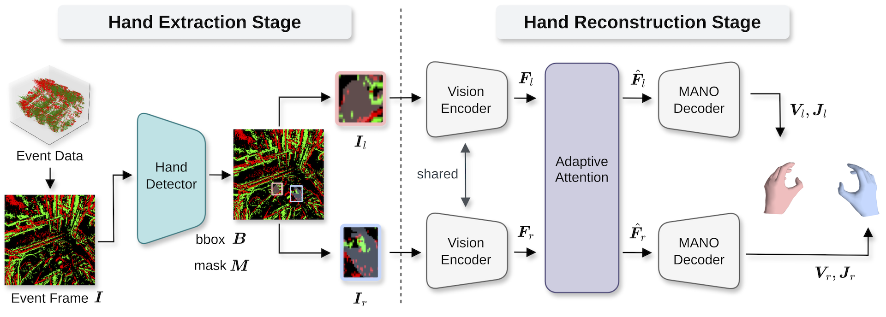
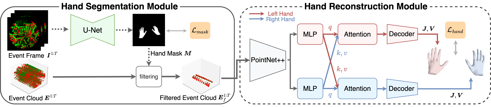
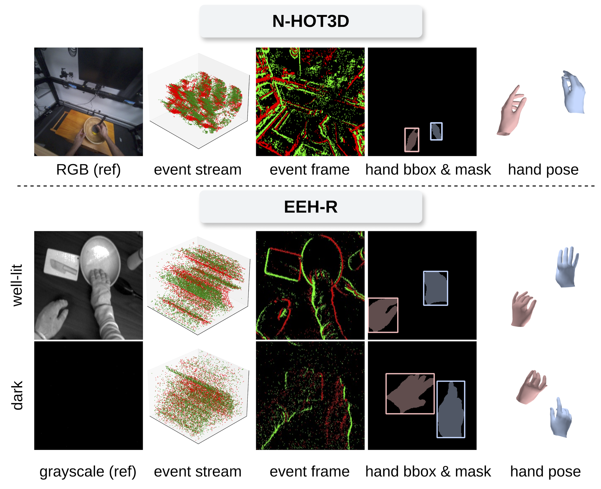

<div align="center">

# EventEgoHands++: Event-based Egocentric 3D Hand Mesh Reconstruction with Real Dataset

[Ryosei Hara](https://ryhara.github.io/)<sup>1</sup>,
[Wataru Ikeda](https://wataru823.github.io/)<sup>1</sup>, 
[Masashi Hatano](https://masashi-hatano.github.io/)<sup>1</sup>, 
[Mariko Isogawa](https://isogawa.ics.keio.ac.jp/)<sup>1,2</sup>


<sup>1</sup> Keio University, <sup>2</sup> JST Presto<br>

<font color="red"><strong>IEEE Access 2026</strong></font>


<a href='https://ryhara.github.io/EventEgoHandsV2/'></a>
<a href='#'></a>
<a href='https://forms.gle/fkUq73ZCriLJ6vFU8'></a>

<a href='https://ryhara.github.io/EventEgoHands/'></a>
<a href='https://arxiv.org/abs/2505.19169'></a>
<a href='https://forms.gle/qza3hqaK6AXH7JoZ7'></a>

</div>


This is the official implementation of [EventEgoHands++ (IEEE Access 2026)](https://ryhara.github.io/EventEgoHandsV2/) and [EventEgoHands (ICIP 2025)](https://ryhara.github.io/EventEgoHands/)

- `src/v2/` : EventEgoHandsV2 (IEEE Access 2026)

<div align="center">
  
</div>

- `src/v1/` : EventEgoHandsV1 (ICIP 2025)

<div align="center">
  
</div>

## Download Datasets

- **N-HOT3D**
  - [Request Form](https://forms.gle/qza3hqaK6AXH7JoZ7) 
  -  [Document](https://github.com/ryhara/N-HOT3D)
- **EEH-R**
  - [Request Form](https://forms.gle/fkUq73ZCriLJ6vFU8)
  - [Document](docs/README_EEHR.md)
 

<div align="center">
  
</div>


## Setup

Install [uv](https://docs.astral.sh/uv/) and run:

```bash
git clone --recursive https://github.com/ryhara/EventEgoHandsV2.git
cd EventEgoHandsV2
uv sync
source .venv/bin/activate
bash scripts/setup_hot3d.sh   # initialize the hot3d submodule and patch it
```

<details>
<summary>What <code>scripts/setup_hot3d.sh</code> does (and how to patch manually)</summary>

[hot3d](https://github.com/facebookresearch/hot3d) is included as a git submodule.
The script initializes the submodule and applies `scripts/hot3d_mano_layer.patch`
(a `num_pose_coeffs` argument and a device fix in `mano_layer.py`).
It is idempotent, so it is safe to run again (e.g. after `git submodule update`).

To apply the fix manually instead, edit `./hot3d/hot3d/data_loaders/mano_layer.py`:

```diff
    def __init__(
        self,
        mano_model_files_dir: str,
        joint_mapper: Optional[List] = mano_joint_mapping,
+       num_pose_coeffs: int = 15,
    ):
```

```diff
-    self.num_pose_coeffs = 15
+    self.num_pose_coeffs = num_pose_coeffs
```

```diff
            if left_mano_output.joints.shape[1] != self.N_LANDMARKS:
                extra_joints = torch.index_select(
                    left_mano_output.vertices,
                    1,
                    torch.tensor(
                        list(self.MANO_FINGERTIP_VERT_INDICES.values()),
                        dtype=torch.long,
+                       device=self.device,
                    ),
                )
```

```diff
            if right_mano_output.joints.shape[1] != self.N_LANDMARKS:
                extra_joints = torch.index_select(
                    right_mano_output.vertices,
                    1,
                    torch.tensor(
                        list(self.MANO_FINGERTIP_VERT_INDICES.values()),
                        dtype=torch.long,
+                       device=self.device,
                    ),
                )
```

</details>

### MANO

- Go to the [MANO website](https://mano.is.tue.mpg.de/)
- Sign up and download `MANO_LEFT.pkl`, `MANO_RIGHT.pkl`
- Put the files into `src/mano/models`

## Usage

Run every command from the project root. Set the dataset and checkpoint paths in
the config file first; trained weights are written to `data/save/`.

Both versions run hand segmentation first, then feed its output to the hand mesh
model, so train the segmentation model before the hand model.

### v1 (EventEgoHandsV1)

U-Net segmentation, then a point-cloud based MANO regressor.

```bash
# Synthetic (N-HOT3D)
python src/v1/train_seg_nhot3d.py --config src/v1/config/config_train_seg_nhot3d.yaml  # segmentation train
python src/v1/eval_seg_nhot3d.py --config src/v1/config/config_test_seg_nhot3d.yaml    # segmentation eval
python src/v1/train_nhot3d.py --config src/v1/config/config_train_nhot3d.yaml          # hand mesh train
python src/v1/test_nhot3d.py --config src/v1/config/config_test_nhot3d.yaml            # hand mesh test

# Real (EEH-R)
python src/v1/train_seg_eehr.py --config src/v1/config/config_train_seg_eehr.yaml
python src/v1/eval_seg_eehr.py --config src/v1/config/config_train_seg_eehr.yaml
python src/v1/train_eehr.py --config src/v1/config/config_train_eehr.yaml
python src/v1/test_eehr.py --config src/v1/config/config_train_eehr.yaml

# Compare predictions with the ground truth in Rerun
python src/v1/vis_nhot3d.py --config src/v1/config/config_test_nhot3d.yaml --sequence-ids P0002_016222d1
python src/v1/vis_eehr.py --config src/v1/config/config_train_eehr.yaml --sequence-ids P04_01
```

### v2 (EventEgoHandsV2)

YOLO instance segmentation, then a masked-image based MANO regressor with attention.

```bash
# Hand segmentation (YOLO; edit the constants at the top of each script)
python src/v2/train_yolo_seg.py
python src/v2/eval_yolo_seg.py        # mAP over a confidence sweep
python src/v2/eval_yolo_seg_pixel.py  # pixel-level IoU / Dice / F1

# Hand mesh (the dataset is selected by the config)
python src/v2/train.py --config src/v2/config/config_nhot3d.yaml  # Synthetic (N-HOT3D)
python src/v2/test.py --config src/v2/config/config_nhot3d.yaml
python src/v2/train.py --config src/v2/config/config_eehr.yaml    # Real (EEH-R)
python src/v2/test.py --config src/v2/config/config_eehr.yaml

# Compare predictions with the ground truth in Rerun
python src/v2/vis.py --config src/v2/config/config_nhot3d.yaml --sequence-ids P0002_016222d1
python src/v2/vis.py --config src/v2/config/config_eehr.yaml --sequence-ids P04_01
```

### Viewers

Dataset viewers and the prediction-vs-ground-truth viewers share the same output
options (live viewer, browser, `.rrd` file). See
[src/viewer/README.md](src/viewer/README.md).

## Citation

### IEEE Access 2026
```bibtex
@article{hara2026eventegohands2,
  author = {Hara, Ryosei and Ikeda, Wataru and Hatano, Masashi and Isogawa, Mariko},
  journal = {IEEE Access},
  title = {EventEgoHands++: Event-based Egocentric 3D Hand Mesh Reconstruction with Real Dataset},
  year = {2026},
  volume = {},
  number = {},
}
```

### ICIP 2025
```bibtex
@inproceedings{Hara2025EventEgoHands,
  author={Hara, Ryosei and Ikeda, Wataru and Hatano, Masashi and Isogawa, Mariko},
  title={EventEgoHands: Event-based Egocentric 3D Hand Mesh Reconstruction},
  booktitle={IEEE International Conference on Image Processing (ICIP)},
  year={2025},
  pages={1199-1204},
  doi={10.1109/ICIP55913.2025.11084751},
}
```

## License

This project is licensed under CC-BY-NC-4.0. See [LICENSE](./LICENSE).

## Code References

- [Chris10M/Ev2Hands](https://github.com/Chris10M/Ev2Hands)
- [r00tman/EventHands](https://github.com/r00tman/EventHands)
- [facebookresearch/hot3d](https://github.com/facebookresearch/hot3d)
- [facebookresearch/projectaria_tools](https://github.com/facebookresearch/projectaria_tools)
